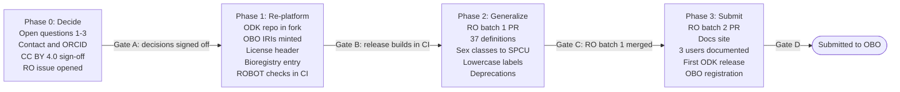

# KIN to OBO Foundry: Project Plan

Oct 1, 2026 · Melissa Haendel

_Snapshot of the shared review doc, exported 2026-10-01. Comments and edits happen in the doc; this copy is versioned with the ontology._

## Summary

We plan to bring KIN, the GA4GH family relations ontology, to an OBO Foundry submission as a pedigree ontology for any organism. KIN is small and well axiomatized (49 relations, 8 classes, every term defined). What it lacks is OBO packaging: an open license, OBO identifiers, release tooling, reuse of RO and PATO, and organism-neutral definitions.

The work runs in four phases on the fork `mellybelly/pedigree_family_history_terminology`. The heaviest content changes are generalizing 37 human-specific definitions, moving six core kinship relations into RO, and aligning KIN's sex classes one to one with HL7 clinical codes, including unknown sex. A review of the axioms also found 8 logic errors to fix, among them one that forces unknown sex to be female or male.

**What we need from reviewers:**

- Comment on the decisions already made, the 8 axiom fixes, and the destination of each term in the Proposed changes tab.
- Answer the three open questions.
- Flag anyone who must sign off on relicensing to CC BY 4.0 or on the RO proposal.

Every proposed change, term by term, is listed in [Proposed changes](kin-obo-proposed-changes.md).

## Decisions already made

These were settled at kickoff. Reviewers can still challenge any of them.

| Topic | Decision | Consequence |
| --- | --- | --- |
| Goal | Submit KIN to the OBO Foundry | Must meet all OBO principles (FP-001 to FP-020) |
| Scope | Pedigree relations among individuals of any organism, within a pedigree | Evolutionary or lineage relations between taxa are out of scope. Human-specific definitions need generalizing. |
| Identifiers | OBO PURLs added alongside GA4GH IRIs and plain CURIEs | Releases use `obo:KIN_#######`. GA4GH IRIs keep resolving, and Bioregistry lists both URI formats. |
| License | CC BY 4.0 for the ontology | Needs sign-off from GA4GH and past contributors. The Java code can stay Apache-2.0. |
| Upper ontology | No BFO | Import RO as an extracted module with its BFO axioms stripped |
| Relations | Reuse RO, and add KIN's general relations to RO | Requires an RO pull request (see the RO vs. KIN split) |
| Sex | KIN sex classes match HL7 Sex Parameter for Clinical Use (SPCU) one to one, including unknown sex; female and male sit under PATO | Clinical data maps directly to KIN classes. The axioms still work for any organism. |
| Human-only relations | Stay in KIN for now | Adoptive, step and legal relations are annotated as human-only |
| Repository | Development in this fork | Point the README and the upstream GA4GH repo here |
| FHIR FamilyMember mapping | Deferred | The existing 119-row file stays as is |

## Open questions for reviewers

Three questions block Phase 2. Each has a recommendation; please reply in a comment on the row.

| # | Question | Recommendation |
| --- | --- | --- |
| 1 | Should RO's maternal and paternal parent be defined by the gamete contributed (egg or ovule vs. sperm or pollen), or by the parent's sex? | By gamete. That works for plants, hermaphrodites and sex-changing species. KIN keeps "mother of" and "father of" as labels. |
| 2 | Should the first RO request be the 6 core properties only, or also include full/half sibling and ancestor/descendant? | 6 core properties only. A smaller request is faster to review. |
| 3 | Who is the responsible contact (name, ORCID, GitHub) in the ontology metadata? | Needs a person; no default. |

Also: does anyone else need to sign off on the CC BY 4.0 relicense besides GA4GH and the 8 past committers?

## Current state

KIN meets 1 of 18 OBO checks fully, 9 partly, and has 7 gaps; 1 applies only after registration. This was assessed at commit `71616ea`. The last release was 2021-08-05 and the last commit was in September 2024.

Key numbers:

- 49 object properties, 8 classes, 7 property chains, 3 JUnit reasoner tests.
- 57 of 57 terms have a label and a definition, but 37 of 58 definitions are written for humans ("person", "man", "woman").
- 11 domain and range rules use the human-only classes Man/Woman (Person with female or male sex) for biological roles (mother, father, donors, aunt, uncle).
- 0 terms are reused from OBO ontologies.
- 12 IDs are missing from the 001–061 range with no obsolete records.

| Principle | Status | Main gap |
| --- | --- | --- |
| FP-001 Open | Gap | Apache-2.0 today. Move to CC BY 4.0 and add a license annotation. |
| FP-002 Format | Partial | Functional syntax only. Release RDF/XML, OBO and JSON. |
| FP-003 URIs | Partial | Hash IRIs with 3-digit IDs and inconsistent prefixes. Mint OBO IRIs. |
| FP-004 Versioning | Partial | Version IRI on the wrong path. No release process. |
| FP-005 Scope | Partial | Scope is decided, but the content is human-centric. |
| FP-006 Definitions | Partial | Present, but human-specific. Move to IAO:0000115. |
| FP-007 Relations | Gap | No RO reuse. |
| FP-008 Documented | Partial | README only. |
| FP-009 Users | Partial | Need 3 users, at least one non-human. |
| FP-010 Collaboration | Met | Public GitHub with PR review. |
| FP-011 Authority | Gap | No named contact. |
| FP-012 Naming | Gap | camelCase labels. |
| FP-013 Notification | After registration | — |
| FP-014 Guidelines | Gap | No CONTRIBUTING file or code of conduct. |
| FP-016 Maintenance | Partial | No release in 5 years. |
| FP-019 Stability | Gap | No obsoletion policy or records. |
| FP-020 Responsiveness | Partial | No active tracker on the fork. |
| Tooling | Gap | Maven/JFact only. No ODK or ROBOT. |

## Proposed split: RO vs. KIN

We propose adding 6 core kinship properties to RO in a first request, and 7 more in a second (5 existing KIN terms plus a new ancestor/descendant pair); everything else stays in KIN. RO (release 2026-09-04) has no parent, child or sibling relations between individual organisms. Its nearest relation, "shares ancestor with" (RO:0002158), belongs to RO's evolutionary relations, which are out of KIN's scope, so KIN will not use it.

**A relation goes to RO** when it applies to any organism, is useful beyond pedigree drawing (model-organism databases, breeding, population genetics), and is a building block for other relations. **It stays in KIN** when it is any of these:

- a shortcut defined by a property chain
- a maternal or paternal variant of another relation
- specific to assisted reproduction
- social or legal
- mainly for pedigree drawing

| Where | KIN term(s) | Proposed RO label | Why |
| --- | --- | --- | --- |
| RO batch 1 | KIN\_002 isBiologicalRelativeOf | biological relative of | Gives RO a kinship root that is separate from evolutionary relations |
| RO batch 1 | KIN\_003 isBiologicalParentOf / KIN\_032 isBiologicalChildOf | biological parent of / has biological parent | The core building block. Every other kinship relation derives from it. |
| RO batch 1 | KIN\_027 isBiologicalMotherOf / KIN\_028 isBiologicalFatherOf | maternal parent of / paternal parent of | Defined by the gamete contributed (open question 1) |
| RO batch 1 | KIN\_007 isBiologicalSiblingOf | biological sibling of | Shares at least one biological parent. Symmetric, not transitive. |
| RO batch 2 | KIN\_008, KIN\_012 | full sibling of, half sibling of | General; used for relatedness coefficients |
| RO batch 2 | New | biological ancestor of / biological descendant of | Transitive closure of parent. Supports inbreeding and lineage queries. |
| RO batch 2 | KIN\_009–011 | co-twin or litter-mate of, monozygotic sibling of | General across mammals once the definitions cover litters |
| KIN | KIN\_001 isRelativeOf | — | KIN's root. It spans biological and social kinship. |
| KIN | Grandparent, grandchild, parental sibling, aunt/uncle, cousin, maternal/paternal half sibling | — | Property-chain shortcuts over the RO terms |
| KIN | Donors and gestational carrier (KIN\_004–006, 029, 038, 039) | — | Specific to assisted reproduction; generalized for animal breeding |
| KIN | Partner, mate and consanguinity (KIN\_026, 030, 050, 051) | — | Pedigree-drawing concepts |
| KIN | Social and legal (KIN\_019–025, 056, 057) | — | Human-only ones are annotated as such. Foster parent also applies to animals. |
| KIN | KIN\_031 hasSex | — | Subproperty of RO:0000053 "bearer of", with the BFO range stripped |

## Sex modeling

KIN keeps its own sex classes, one for each HL7 Sex Parameter for Clinical Use (SPCU) code, so human clinical data maps one to one, including unknown sex. KIN female and male sit under PATO's female and male, so the logical axioms still hold for any organism. The SPCU value set (`http://terminology.hl7.org/ValueSet/sex-parameter-for-clinical-use`, code system OID 2.16.840.1.113883.4.642.4.2038) is published by HL7 as CC0, so it is compatible with CC BY 4.0.

| KIN class (proposed label) | HL7 SPCU code | Parent | Notes |
| --- | --- | --- | --- |
| KIN\_997 sex | the value set | PATO:0000047 biological sex | Root of the KIN sex classes. Its covering axiom ("sex = female or male") is removed. |
| KIN\_995 female | female-typical | PATO:0000383 female | Used in the mother, maternal and aunt axioms. Disjoint with male. |
| KIN\_996 male | male-typical | PATO:0000384 male | Used in the father, paternal and uncle axioms |
| KIN\_991 specified sex (was OtherSex) | specified | KIN\_997 | Covers intersex and other cases. PATO hermaphrodite (PATO:0001340) or DSD terms can be added when known. |
| KIN\_992 unknown sex | unknown (data-absent-reason) | KIN\_997 | Means sex was recorded as unknown. Not disjoint with female or male, so a parent of unknown sex can still be a mother or father. |
| KIN\_993/994 Woman/Man | — | — | Currently defined as Person with female or male sex, which is human-only. Deprecate, and rewrite the 11 domain and range rules as "has sex some female" or "has sex some male". |
| KIN\_998 Person | — | — | Drop the domain and range on isRelativeOf. Use RO "in taxon" where a species matters. |

The four SPCU codes map to the four KIN classes one to one. They are recorded as `skos:closeMatch` because SPCU codes name a clinical reference range rather than observed sex; reviewers may prefer `exactMatch`. The SPCU-to-KIN mapping ships as a small SSSOM file in Phase 2. hasSex stays functional, so each individual has one sex value.

## Identifiers and licensing

Terms will be usable through three identifier forms; the ontology content moves to CC BY 4.0.

**Identifiers.** OBO principle FP-003 requires the released file to use OBO PURLs. It doesn't forbid other identifiers.

| Form | Example | How it resolves |
| --- | --- | --- |
| OBO PURL (primary in releases) | `http://purl.obolibrary.org/obo/KIN_0000003` | OBO PURL service, after registration |
| GA4GH IRI (kept) | `http://purl.org/ga4gh/kin.owl#KIN_003` | Existing GA4GH PURL redirect; recorded on each term as an equivalent identifier |
| CURIE | `KIN:0000003` | Bioregistry, with both URI formats listed |

- Map the old 3-digit IDs to new 7-digit IDs one to one (KIN\_003 becomes KIN\_0000003), so the numbers stay recognizable.
- Fix the inconsistent prefixes in the current file: the default prefix points to `fh.owl`, `ga4gh:` points to `rel.owl#`, and the version IRI sits under `/rel/`.
- The `KIN` prefix appears unclaimed in the OBO registry as of 1 Oct 2026. Reserve it in Bioregistry early.

**License.**

- Collect agreement to relicense from GA4GH and the 8 people who have committed to the repo.
- Add `dcterms:license <https://creativecommons.org/licenses/by/4.0/>` to the ontology header.
- Split the repo license: CC BY 4.0 for the ontology files, Apache-2.0 for the Java code.

## Work plan

The work runs in four phases. Each phase ends at a gate that must pass before the next phase starts. Phase 2 depends on outside reviewers, because RO editors must accept batch 1.

Phases are shown at equal width, not to scale. No dates are set yet.

**Phase 0: Decide.** Exit at Gate A, when all three open questions are answered and sign-off is collected.

- [ ] Circulate this plan and collect answers to the open questions
- [ ] Name the responsible contact (ORCID, GitHub)
- [ ] Collect CC BY 4.0 agreement from GA4GH and past contributors
- [ ] Open an RO issue describing the batch 1 kinship relations

**Phase 1: Re-platform.** Exit at Gate B, when a release builds in CI from the ODK repo.

- [ ] Seed an ODK repo on `claude/wizardly-wright-2nfcdk`; keep the JUnit reasoner tests
- [ ] Mint OBO IRIs (KIN\_003 becomes KIN\_0000003), record GA4GH IRIs on each term, fix the prefixes and the version IRI
- [ ] Add the CC BY 4.0 header, contact, description and `owl:versionInfo`; split the repo license
- [ ] Register `KIN` in Bioregistry with both URI formats
- [ ] Run ROBOT reason, report and the no-BFO check in CI; release OWL, OBO and JSON

**Phase 2: Generalize and align.** Exit at Gate C, when RO batch 1 is merged and KIN builds on it.

- [ ] Open the RO pull request for batch 1; rebase KIN's relations onto the new RO terms
- [ ] Rewrite the 37 human-specific definitions to be organism-neutral; move them to IAO:0000115 with sources
- [ ] Align the KIN sex classes to HL7 SPCU (rename OtherSex to specified sex, keep unknown sex, remove the female-or-male covering axiom); place female and male under PATO; rewrite the 11 Man/Woman domain and range rules; add the SPCU-to-KIN SSSOM file and a reasoner test for unknown sex
- [ ] Lowercase labels, with the camelCase forms kept as synonyms; apply the 8 axiom fixes once reviewers approve them
- [ ] Deprecate retired classes with `term replaced by`; add obsolete stubs for missing IDs if they were ever published
- [ ] Annotate human-only relations; add CONTRIBUTING and the code of conduct

**Phase 3: Submit.** Exit at Gate D, when the OBO registration request is filed.

- [ ] Open the RO batch 2 request (full and half sibling, ancestor/descendant, multiple birth)
- [ ] Publish a docs site with human and non-human pedigree examples
- [ ] Document 3 users, at least one non-human
- [ ] Cut the first ODK release and pass the OBO dashboard checks
- [ ] File the OBO Foundry registration request

## Risks and dependencies

The two outside dependencies that most affect the schedule are contributor sign-off for CC BY 4.0 and RO editors accepting the kinship relations.

| Risk | Effect | Mitigation |
| --- | --- | --- |
| Relicensing sign-off is slow or incomplete | Blocks FP-001 and registration | Start in Phase 0. If a contributor can't be reached, ask GA4GH, as the project host, to confirm the relicense. |
| RO editors reject or reshape the kinship relations | KIN keeps local relations longer | Keep batch 1 small and organism-general. Discuss on an RO issue before opening the PR. Interim: KIN-local properties with `term replaced by` once RO lands. |
| Gamete-based mother/father definitions are contested | Delays batch 1 | Bring both definitions to the RO discussion. Fall back to definitions based on PATO sex. |
| RO import pulls BFO in | Conflicts with the no-BFO decision | Use a ROBOT extract that strips BFO domain and range axioms. Add a CI check that fails if any BFO term appears. |
| Existing users of GA4GH IRIs or FHIR codes break | Downstream breakage | Keep GA4GH IRIs resolving; keep `kin-fhir.json` generation until FHIR work resumes |
| Generalized definitions lose clinical precision | Pushback from human-genetics users | Keep human-specific wording as comments or examples alongside the organism-neutral definitions |

**People needed:**

- An ontology editor
- A GA4GH Pedigree representative (license and users)
- An RO editor contact
- A reviewer from a non-human pedigree community, for example model-organism databases or animal breeding

## Out of scope and sources

Deferred until after OBO registration:

- Making the FHIR FamilyMember SSSOM file valid (119 rows)
- Moving `kin-fhir.json` generation into the release
- SNOMED CT, HL7 v2 and OMRSE mappings

Out of scope: evolutionary or taxon-level relations, and gender identity.

Sources:

- [KIN repository (fork)](https://github.com/mellybelly/pedigree_family_history_terminology), commit 71616ea
- [OBO Foundry principles](https://obofoundry.org/principles/fp-000-summary.html) and [registry](https://github.com/OBOFoundry/OBOFoundry.github.io/blob/master/registry/ontologies.yml)
- [Relation Ontology](http://purl.obolibrary.org/obo/ro.owl), release 2026-09-04
- [PATO](http://purl.obolibrary.org/obo/pato.owl), release 2025-05-14
- [HL7 Sex Parameter for Clinical Use](https://terminology.hl7.org/5.5.0/CodeSystem-sex-parameter-for-clinical-use.html) and [Gender Harmony terminology](https://build.fhir.org/ig/HL7/fhir-gender-harmony/terminology.html)
- [ODK](https://github.com/INCATools/ontology-development-kit) and [ROBOT](https://robot.obolibrary.org/), the proposed build tools
